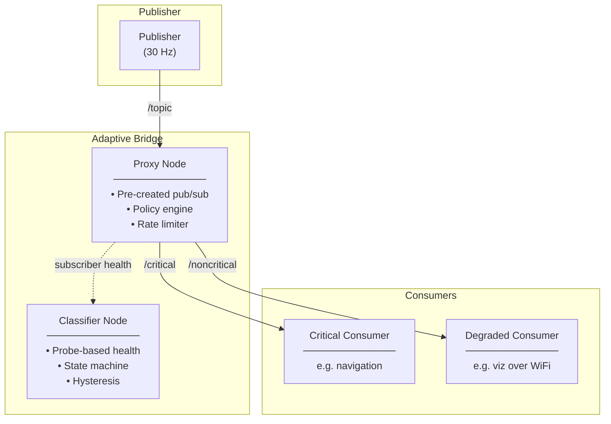

<div align="center">

<h1>Adaptive Bridge</h1>

[](https://docs.ros.org/en/jazzy/)
[](https://www.python.org/)
[](https://www.eprosima.com/)
[](https://cyclonedds.io/)
[](LICENSE)
[]()
[]()
[]()

</div>

In ROS 2 based systems, every subscriber on a topic is coupled to every other subscriber through the DDS writer's shared history cache. When one subscriber falls behind, perhaps because it is connected over a degraded WiFi link, the entire write pipeline backs up. The publisher stalls, and every consumer of that topic, including safety-critical ones, suffers the same delay. Traditional QoS tuning, such as switching to BEST_EFFORT, helps only at the margins; it does not break the structural coupling between subscribers with fundamentally different latency requirements.

Adaptive Bridge solves this by inserting a lightweight proxy between the publisher and its subscribers. The proxy subscribes to the original topic and republishes each message onto two separate output topics: one for critical consumers and one for noncritical or degraded consumers. A classifier monitors subscriber health through active probes and adjusts per-topic rate limits and drop policies in real time. The critical path is preserved regardless of what happens on the noncritical side. This decoupling means that a visualisation node on a congested WiFi link can experience packet loss and rate limiting without affecting a safety-critical navigation node on the same data stream.

---

## Table of Contents

- [Adaptive Bridge](#adaptive-bridge)
  - [Table of Contents](#table-of-contents)
  - [Features](#features)
  - [Architecture Overview](#architecture-overview)
  - [Prerequisites](#prerequisites)
  - [Installation](#installation)
    - [Docker (for evaluation experiments)](#docker-for-evaluation-experiments)
  - [Quickstart](#quickstart)
  - [Configuration](#configuration)
  - [Running the Evaluation Harness](#running-the-evaluation-harness)
  - [RMW Compatibility](#rmw-compatibility)
  - [Components Reference](#components-reference)
  - [Development](#development)
    - [Code Structure](#code-structure)
  - [Troubleshooting](#troubleshooting)
  - [Contributing](#contributing)
  - [License](#license)

---

## Features

| Feature | Description |
|---|---|
| **Topic splitting** | Any configured input topic → dual output topics (`critical` and `noncritical`) |
| **Generic message types** | Works with any ROS 2 message type (`LaserScan`, `Image`, `Imu`, `PointCloud2`, custom types) |
| **Real-time classification** | Active probe-based subscriber health monitoring (RTT, loss, jitter) with configurable thresholds |
| **State machine** | `UNKNOWN → CRITICAL ↔ NONCRITICAL` with hysteresis, flap suppression, and forced overrides |
| **Policy-driven degradation** | Token-bucket rate limiting, stale-drops, queue-overflow drops, mode-based policies (`NORMAL` / `DEGRADED` / `DISABLED` / `FAILURE`) |
| **Dual-vendor DDS** | Fully tested on both **Fast DDS** (eProsima) and **Cyclone DDS** (Eclipse) |
| **Observability** | Structured JSON diagnostics payload at 1 Hz with monotonic sequence numbers |
| **Safety supervisor** | Global mode machine (`EMERGENCY` / `FAILURE`) triggered by queue pressure, callback lag, internal error counts |
| **Security** | Optional HMAC signing + replay protection for classifier control-plane signals |
| **Evaluation harness** | Docker-based reproducible experiments with Gilbert-Elliot bursty loss (tc/netem), one-command runner, and automated plots |

---

## Architecture Overview



**Key design rule:** All publishers are pre-created at startup and never recreated at runtime. Topic routes are frozen after initialization.

---

## Prerequisites

- **ROS 2 Jazzy** (Ubuntu 24.04 / Noble)
- **Python 3.12+**
- **Colcon** build system
- **Docker** (for evaluation harness)
- **Python packages:** `pyyaml`, `matplotlib`, `numpy`

---

## Installation

```bash
# Clone the repository
git clone https://github.com/KaushalrajPuwar/adaptive-bridge.git
cd adaptive-bridge

# Build
colcon build --packages-select adaptive_bridge

# Source
source install/setup.bash
```

### Docker (for evaluation experiments)

```bash
cd eval
sudo docker build -t adaptive_bridge_eval:latest -f docker/Dockerfile .
```

---

## Quickstart

```bash
# Launch the full bridge stack (proxy + classifier)
ros2 launch adaptive_bridge test_bridge.launch.py

# In another terminal, check the classifier state
ros2 topic echo /adaptive_bridge/classifier/state

# In another terminal, check diagnostics
ros2 topic echo /adaptive_bridge/diagnostics
```

This starts the proxy with one configured topic (`/scan` → `/adaptive_bridge/critical/scan` + `/adaptive_bridge/noncritical/scan`) and the classifier at 2 Hz evaluation rate.

---

## Configuration

The bridge is configured via a single YAML file. Three example profiles are provided:

```yaml
# config/default.yaml: Full-featured: classifier on, probes 5 Hz
# config/minimal.yaml: Lightweight: lower resource usage
# config/stress.yaml: High-throughput: faster evaluation, tighter safety
```

**Key configuration sections:**

| Section | Purpose |
|---|---|
| `topics` | Topic routes (input, critical output, noncritical output, message type) |
| `qos_profiles` | Named QoS templates (reliability, history, depth, durability) |
| `classifier` | Probe-based health monitoring thresholds (RTT, loss, hysteresis) |
| `probes` | Active probe protocol parameters (rate, timeout, window) |
| `routing_policy` | Per-mode policies: normal, degraded, disabled, emergency, failure |
| `safety` | Safety supervisor configuration (queue limits, overload behaviour) |
| `security` | HMAC signing and replay protection |
| `diagnostics` | Diagnostics publishing interval and verbosity |

**Custom config:**

```bash
ros2 launch adaptive_bridge adaptive_bridge.launch.py config_path:=/path/to/your/config.yaml
```

---

## Running the Evaluation Harness

A self-contained evaluation workspace lives at `eval/`. It runs reproducible
baseline-vs-adaptive experiments under a **Gilbert-Elliot bursty loss** channel
model using Docker containers and `tc`/`netem`.

```bash
cd eval

# Build the Docker image (one-time)
sudo docker build -t adaptive_bridge_eval:latest -f docker/Dockerfile .

# Run a clean baseline (60 s smoke test)
sudo python3 scripts/run_experiment.py \
    --scenario baseline_clean \
    --duration 60 \
    --skip-build

# Run an adaptive bridge experiment with impairment
sudo python3 scripts/run_experiment.py \
    --scenario bridge_moderate \
    --duration 180 \
    --skip-build

# Run on a different DDS vendor
sudo python3 scripts/run_experiment.py \
    --scenario bridge_moderate \
    --rmw rmw_cyclonedds_cpp \
    --skip-build
```

**Available scenarios** (defined in `eval/scenarios.yaml`):

| Scenario | Mode | Impairment | Duration |
|---|---|---|---|
| `baseline_clean` | Baseline | None | 120 s |
| `baseline_mild` | Baseline | GE ~2.3% | 180 s |
| `baseline_moderate` | Baseline | GE ~7.1% | 180 s |
| `baseline_strong` | Baseline | GE ~9.2% | 180 s |
| `bridge_clean` | Bridge | None | 120 s |
| `bridge_mild` | Bridge | GE ~2.3% | 180 s |
| `bridge_moderate` | Bridge | GE ~7.1% | 180 s |
| `bridge_strong` | Bridge | GE ~9.2% | 180 s |
| `bridge_toggle` | Bridge | Toggle moderate | 240 s |
| `ablation_no_classifier` | Bridge | GE ~7.1% | 180 s |

Each run produces a structured results directory with CSVs, summary statistics,
and plots:

```text
results/YYYY-MM-DD_HH-MM-SS_<scenario>/
├── run_metadata.yaml      # Scenario, RMW, git commit, duration
├── system_info.yaml       # CPU, RAM, kernel, Docker version
├── metrics/               # CSV files: latency, throughput, drops, classifier
├── logs/                  # Docker container logs
├── raw/                   # tc rules, filters (qdisc state)
├── plots/                 # CDFs, time series, classifier timeline
└── summary/               # Stats, table, human-readable report
```

---

## RMW Compatibility

Adaptive Bridge is tested on both major ROS 2 DDS implementations:

| RMW | Support | Notes |
|---|---|---|
| **Fast DDS** (eProsima) | ✅ Full | Default RMW. Pre-production tested with explicit `max_samples=200` XML profile |
| **Cyclone DDS** (Eclipse) | ✅ Full | Tested with `AllowMulticast=spdp` for unicast data to enable tc/IP-based impairment. Uses byte-based WHC watermarks instead of Fast DDS's sample-count limits |

**Key behavioural differences documented** (see `docs/17_RMW_COMPATIBILITY_MATRIX.md`):

| Aspect | Fast DDS | Cyclone DDS |
|---|---|---|
| `publish()` under backpressure | Returns error immediately (non-blocking) | Blocks until WHC drains |
| Writer pool limit | `max_samples=200` (sample-count via XML) | `WhcHigh=600kiB` (byte-based, native) |
| Retransmission strategy | Aggressive heartbeat-based (1.3M pkts/run) | Conservative NACK-based (28K pkts/run) |
| Data distribution default | Unicast | Multicast (requires config change for tc filters) |

---

## Components Reference

| Component | File | Description |
|---|---|---|
| **Proxy Node** | `proxy_node.py` | Core bridge: subscribes to input topics, publishes dual critical/noncritical streams, enforces policy |
| **Classifier Node** | `classifier_node.py` | ROS wrapper around the classifier core: probes subscriber health, publishes state |
| **Classifier Core** | `classifier_core.py` | Pure-Python state machine (UNKNOWN/CRITICAL/NONCRITICAL) with hysteresis |
| **Diagnostics** | `diagnostics.py` | Schema-versioned diagnostics payload with 1 Hz publishing |
| **Policy Engine** | `policy_engine.py` | Maps classifier decisions → per-topic policy modes |
| **Noncritical Policy** | `noncritical_policy.py` | Token-bucket rate limiter, stale drops, queue-overflow drops |
| **Safety Supervisor** | `safety_supervisor.py` | Global mode machine (NORMAL/DEGRADED/EMERGENCY/FAILURE) |
| **Config Manager** | `config_manager.py` | YAML loading, schema validation, typed getters |
| **QoS Manager** | `qos_manager.py` | Named QoS profile resolution with three-tier fallback |
| **Topic Registry** | `topic_registry.py` | Deterministic topic-route builder, uniqueness enforcement |
| **Probe Utilities** | `utils/probes.py` | Active probe client/responder, windowed metrics |
| **Security** | `utils/security.py` | HMAC signing + replay protection for control signals |

---

## Development

```bash
# Full clean build
rm -rf build install log
colcon build --packages-select adaptive_bridge
source install/setup.bash

# Run all tests (183+ tests, 0 failures expected)
colcon test --packages-select adaptive_bridge
colcon test-result --verbose

# Run pure unit tests only (no ROS graph)
pytest -q src/tests
```

### Code Structure

```text
src/adaptive_bridge/
├── adaptive_bridge/          # Core package
│   ├── proxy_node.py          ─ Main proxy
│   ├── classifier_node.py     ─ Classifier ROS wrapper
│   ├── classifier_core.py     ─ Classifier state machine
│   ├── config_manager.py      ─ Config loader
│   ├── config_types.py        ─ Typed config models
│   ├── qos_manager.py         ─ QoS resolution
│   ├── policy_engine.py       ─ Classifier → mode mapper
│   ├── noncritical_policy.py  ─ Rate limiter
│   ├── safety_supervisor.py   ─ Global mode machine
│   ├── diagnostics.py         ─ Diagnostics collector
│   ├── topic_registry.py      ─ Route builder
│   ├── models.py              ─ Shared data models
│   └── utils/
│       ├── probes.py          ─ Active probe client/responder
│       └── security.py        ─ HMAC signing
├── config/                    # Example YAML configs
├── launch/                    # ROS 2 launch files
└── test/                      # Lint tests
eval/                          # Evaluation workspace (Docker + tc/netem)
docs/                          # Architecture, design, results
```

---

## Troubleshooting

<details>
<summary>Click to expand troubleshooting guide</summary>

| Symptom | Cause | Solution |
|---|---|---|
| **Containers not starting** | Docker daemon overload | Wait 30 s and retry; add `--skip-build` to avoid image rebuild |
| **No impairment visible** | SHM enabled (default on some DDS configs) | Ensure XML profile disables SHM. See `fastdds_profiles.xml` or `cyclonedds_profiles.xml` |
| **Classifier shows `UNKNOWN`** | No probe data received | Check probe responder is running; verify topic names match |
| **Bridge not forwarding** | Config file not found | Pass absolute path via `config_path:=` parameter |
| **Tests failing** | WS1 install not sourced | Run `source install/setup.bash` first |
| **`CYCLONEDDS_URI` not working** | URI format incorrect | Use `file:///absolute/path/to/file.xml` with triple `///` prefix |

</details>

---

## Contributing

Contributions are welcome post-development. See [`CONTRIBUTING.md`](CONTRIBUTING.md) for guidelines on code standards, pull requests, and the development workflow.

---

## License

Licensed under the **Apache License 2.0**. See [`LICENSE`](LICENSE) for the full text.

